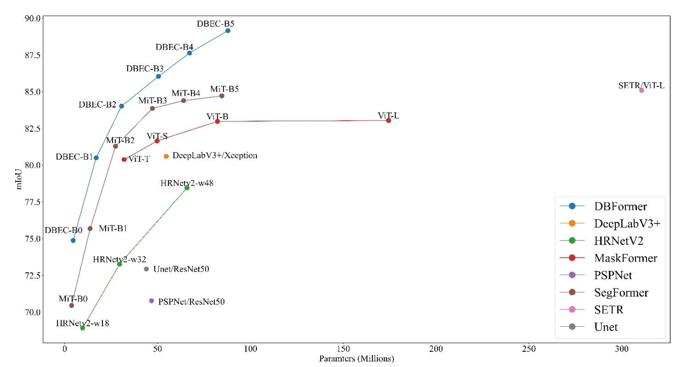
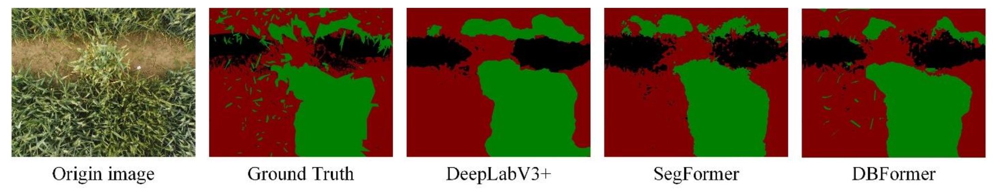

<h1>DBFormer: A Dual-Branch Multiscale Model for Wheat Yellow Dwarf Semi-Automatic labeling and Segmentation Based on UAV Multispectral Images</h1>

      <a style="color: blue; font-size: 1.2em;">Rui Mao1,4</a> 	
  <a style="color: blue; font-size: 1.2em;">Zexi Wang1,6</a>  
  	<a style="color: blue; font-size: 1.2em;">Yuchen Zhang1,5</a>
    <a style="color: blue; font-size: 1.2em;">Feilong Li1</a>
    <a style="color: blue; font-size: 1.2em;">Meili Wang1</a>
    <a style="color: blue; font-size: 1.2em;">Jialin Li1</a>
      <a style="color: blue; font-size: 1.2em;">Xingan Hao2,3✉</a>

  

    1College of Information Engineering, Northwest A&F University
     
    2College of Plant Protection, Northwest A&F University
   
    3State Key Laboratory for Crop Stress Resistance and High-Efficiency Production
     
    4Shaanxi Engineering Research Center of Agricultural Information Intelligent Perception and Analysis
     
    5School of Software, Xi’an Jiao-tong University
     
    6School of Microelectronics, Xidian University

- This study introduces **DBFormer**, A novel dual-branch multiscale model,was proposed for thesegmentation of wheat yellow dwarf disease. This model efficiently captured pathological features sourced from rich multispectral information, achieving mIoU and mAP scores of **87.92%** and **93.77%**, respectively. 

- A novel **semi-automatic labeling method**, based on semi-supervised learning and vegetation indices, was designed to aid in the annotation of multispectral images..
- A unique UAV-based wheat yellow dwarf multispectral dataset, comprising **14,850 images** featuring over 50 distinct wheat varieties, was established.

## DBFormer Performance

:fire: Details of DBFormer will be released. Stay tuned :beers: :+1: 

